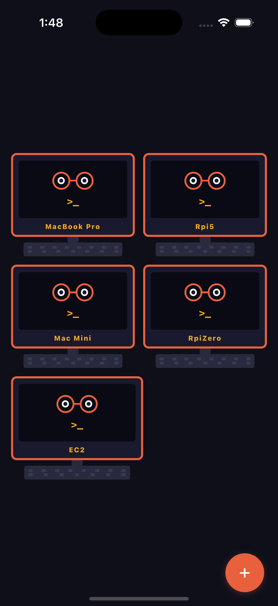
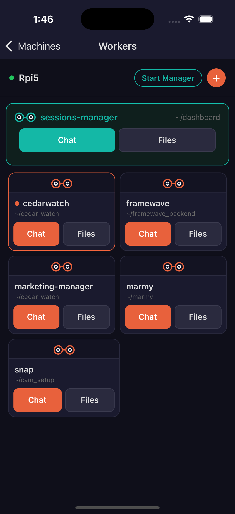
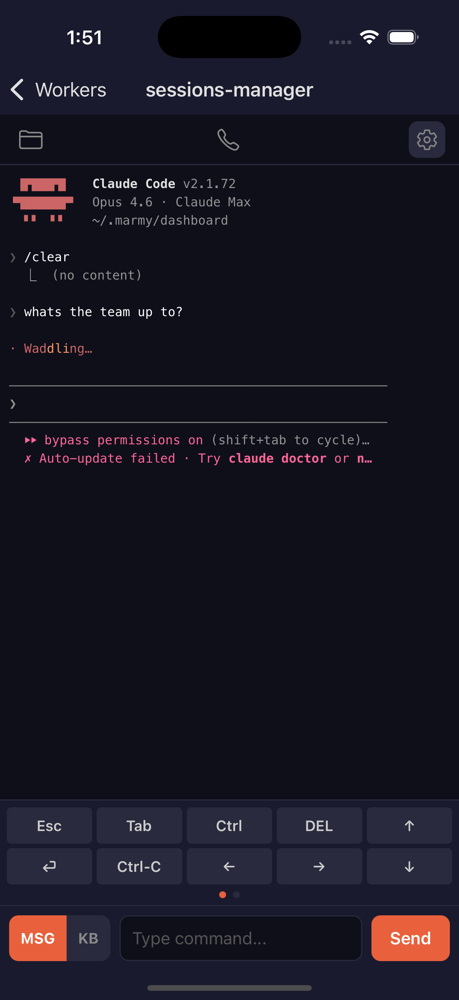
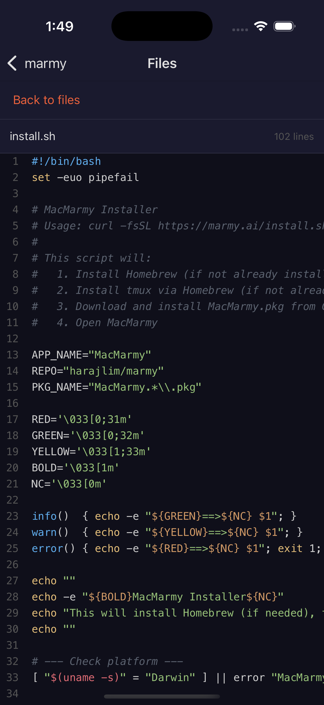
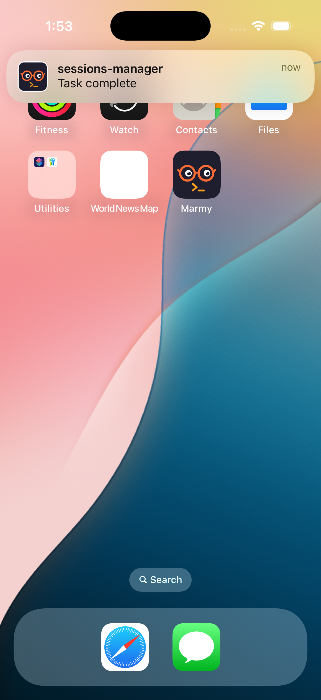

# Marmy

Manage your Claude Code sessions from your phone.

[](LICENSE)
[](https://testflight.apple.com/join/v8HmNu1H)

Website: [marmy.ai](https://marmy.ai)

## What is Marmy

Marmy is a lightweight Rust agent that runs on your machines and an iOS app that connects to it. Together they let you manage your Claude Code sessions (or any tmux terminal agent) from your phone. Read output, send input, browse files, get push notifications, and talk to your agents by voice.

## How it works

The agent runs alongside your terminal sessions. Your phone connects over LAN or Tailscale, authenticated with a token. Everything is self-hosted, open source, and nothing leaves your network.

Any tmux session on the machine is visible and manageable from the app. It is not limited to Claude Code. If it runs in tmux, you can see it and control it from your phone.

## Features

- **Session management**: View, create, and control tmux sessions from your phone
- **File browser**: Browse file trees, read code with syntax highlighting, view diffs, markdown, images, and PDFs
- **Push notifications**: Get notified when a Claude Code session finishes or needs input
- **Voice commands**: A Gemini-powered voice assistant relays your spoken decisions to your agents
- **Manager sessions**: Launch a Claude Code session that supervises and coordinates your other sessions
- **Multi-machine support**: Install the agent on each machine and manage them all from one app

## Screenshots

<p align="center">
  
  &nbsp;&nbsp;
  
  &nbsp;&nbsp;
  
  &nbsp;&nbsp;
  
  &nbsp;&nbsp;
  
</p>

## Quick start (macOS)

### 1. Install MacMarmy

Download MacMarmy from the [latest release](https://github.com/marmy-ai/marmy/releases/latest). Open the app. It runs in your menu bar and starts the agent automatically.

### 2. Get the iOS app

Download from [TestFlight](https://testflight.apple.com/join/v8HmNu1H).

### 3. Pair

Click the MacMarmy icon in your menu bar. Your address and token are shown there. Enter them in the iOS app. If you are using Tailscale, replace the local IP with your machine's Tailscale IP to connect from anywhere.

### 4. Done

Open the Machines tab, tap **+**, enter the address and token, and connect.

## Quick start (Linux)

**Prerequisites:** Rust (latest stable) via [rustup](https://rustup.rs), tmux 3.2+ (`apt install tmux` or `dnf install tmux`).

```bash
git clone https://github.com/marmy-ai/marmy && cd marmy/agent
cargo build --release
./target/release/marmy-agent serve
```

In a separate terminal:

```bash
./target/release/marmy-agent pair
```

Enter the address and token in the iOS app. If you are using Tailscale, replace the local IP with your machine's Tailscale IP to connect from anywhere.

To run the agent as a background service, create `~/.config/systemd/user/marmy-agent.service`:

```ini
[Unit]
Description=Marmy Agent
After=network.target

[Service]
ExecStart=/path/to/marmy-agent serve
Restart=on-failure

[Install]
WantedBy=default.target
```

```bash
systemctl --user daemon-reload
systemctl --user enable --now marmy-agent
```

## Build from source

**Prerequisites:** Rust (latest stable), tmux 3.2+, Node.js 18+, Xcode, CocoaPods.

### Agent

```bash
git clone https://github.com/marmy-ai/marmy && cd marmy/agent
cargo build --release
./target/release/marmy-agent serve
./target/release/marmy-agent pair
```

### MacMarmy (macOS menu bar app)

```bash
cd macos/MarmyMenuBar
xcodebuild -scheme MarmyMenuBar -configuration Release build CODE_SIGNING_ALLOWED=NO
open ~/Library/Developer/Xcode/DerivedData/MarmyMenuBar-*/Build/Products/Release/MarmyMenuBar.app
```

### iOS app

```bash
cd mobile
npm install
npx expo prebuild --platform ios
cd ios && pod install && cd ..
open ios/marmy.xcworkspace
```

In Xcode:

1. Select your signing team under Signing & Capabilities for the `Marmy` target.
2. Set the build configuration to **Release**: Product > Scheme > Edit Scheme > Run > Build Configuration > Release.
3. Connect your iPhone and press **Cmd+R** to build and install.

## Configuration

The agent config lives at `~/Library/Application Support/marmy/config.toml` on macOS or `~/.config/marmy/config.toml` on Linux. See [`agent/config.toml.example`](agent/config.toml.example) for all options.

### File browsing

File browsing works out of the box for any directory where you have an active tmux session. When `allowed_paths` is empty (the default), the agent allows browsing within any active session's working directory.

If you want to restrict access to specific directories only, configure `allowed_paths`:

```toml
[files]
allowed_paths = ["~/projects", "~/code"]
```

If you want to browse files outside of session directories (e.g. a shared assets folder), add those paths to `allowed_paths` as well. All access is read-only.

### Gemini voice

**MacMarmy users**: Click "Set Up Voice Mode..." in the menu bar app. It will prompt you for your Gemini API key and save it to the config automatically.

**Standalone agent / Linux**: Add your API key to the config file manually:

```toml
[voice]
gemini_api_key = "your-key-here"
```

Get a key from [Google AI Studio](https://aistudio.google.com/apikey).

### Push notifications

**TestFlight / App Store builds** use the hosted relay automatically. No configuration needed. The relay URL is set in the default config and routes notifications through a Lambda function.

**Self-built apps** need their own APNs setup. The hosted relay only works for official TestFlight and App Store builds because APNs tokens are tied to the signing team that built the app.

Set up your own APNs key: go to [Apple Developer](https://developer.apple.com) > Keys, create a key with APNs enabled, and download the `.p8` file. Then configure:

```toml
[notifications]
enabled = true
apns_key_path = "~/.marmy/apns_key.p8"
apns_key_id = "XXXXXXXXXX"
apns_team_id = "XXXXXXXXXX"
apns_topic = "com.yourteam.marmy"
apns_sandbox = true
```

`apns_topic` must match your app's bundle identifier in Xcode (Signing & Capabilities). Set `apns_sandbox = true` for dev builds (Xcode), `false` for production.

You can either send notifications directly via APNs (the default when a key is configured) or run your own relay using the code in the `relay/` directory.

### Tailscale

Install [Tailscale](https://tailscale.com/download) on your machine and phone. The agent binds to `0.0.0.0:9876` by default, so your phone can connect via your machine's Tailscale IP.

```bash
tailscale ip -4
# Use this IP as the address in the Marmy app, e.g. 100.x.y.z:9876
```

To restrict the agent to Tailscale only:

```toml
[server]
bind = "100.x.y.z"  # Your Tailscale IP
port = 9876
```

### Multi-machine

Install the agent on each machine. Run `marmy-agent serve` and `marmy-agent pair` on each one. Add each machine in the app. They all appear in the Machines tab.

## Architecture

```
marmy/
  agent/     Rust agent (REST API + WebSocket, tmux subprocess calls)
  mobile/    iOS app (React Native / Expo)
  macos/     macOS menu bar app (Swift, bundles the Rust agent)
  website/   Landing page (Astro)
  relay/     Push notification relay (Node.js Lambda)
```

The agent interacts with tmux by spawning short-lived subprocess calls (`tmux list-sessions`, `tmux capture-pane`, `tmux send-keys`, etc.) and exposes the results via a REST API. No persistent connection or control mode. The mobile app uses REST for all core operations and an optional WebSocket for real-time topology updates.

## Contributing

See [CONTRIBUTING.md](CONTRIBUTING.md).

## License

MIT
